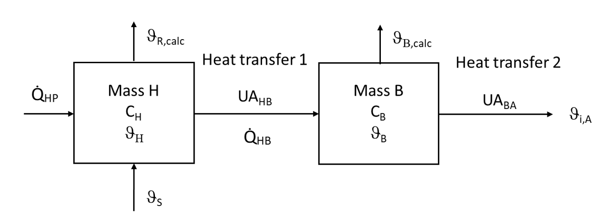

# Load-based-testing method for heat pumps

This repository consists of a simple two-mass building model for load-based testing of heat pumps.
The model is used to define the inertial behavior of the heat sink.

## Installation 

LoadBasedTesting can be installed as package. 
In order to use this package, you can either install it via pip install (see
below) or simply download the python files and use them in your own script. 
Installation steps are:
1.  Download or clone the repository via git: 
`git clone https://github.com/BAMresearch/bam-load-based-testing/`
2. Install package via pip. Use conda prompt console or the terminal within pycharm:
`pip install -e <local path to git repo>`

## Two-mass model

The two-mass model consists of mass H, representing the heat transfer system, and mass B, representing the building envelope. 
Each mass is characterized by a heat capacity MCp and an initial temperature $`\vartheta_\mathrm{start}`$. 

The heat output provided by the heat pump is delivered to mass H. Mass H is connected to mass B, so a heat exchange occurs between mass H and mass B.
Depending on the temperatures of the masses and the supply temperature $`\vartheta_\mathrm{S}`$ provided by the heat pump the heat flow is determined by the thermal conductivity $`UA_\mathrm{HB}`$ between the masses:

$`\dot{Q}_\mathrm{HB} =  UA_\mathrm{HB}\left( \frac{\vartheta_\mathrm{S} + \vartheta_\mathrm{H}}{2} - \vartheta_\mathrm{B} \right)`$

Mass B also exchanges heat with the environment.
The environment is represented by a constant ambient temperature $`\vartheta_\mathrm{A}`$.
The heat flow between mass B and the environment follows the equation:

$`\dot{Q}_\mathrm{BA} =  UA_\mathrm{BA}\left(  \vartheta_\mathrm{B} - \vartheta_\mathrm{A}\right)`$

The associated energy balances of the subsystems determine the temperature changes of masses H and B:

$`\frac{\mathrm{d}\vartheta_\mathrm{H}}{\mathrm{d}t} = \frac{\dot{Q}_\mathrm{HP} - \dot{Q}_\mathrm{HB}}{C_\mathrm{H}}`$

$`\frac{\mathrm{d}\vartheta_\mathrm{B}}{\mathrm{d}t} = \frac{\dot{Q}_\mathrm{HB} - \dot{Q}_\mathrm{BA}}{C_\mathrm{B}}`$

The return temperature $`\vartheta_\mathrm{R}`$ of the heat pump corresponds to the temperature $`\vartheta_\mathrm{H}`$ of mass H.

## Impelmentation in python

The building model is defined in the class "TwoMassBuilding" in "twoMassModel.py" and consists of two objects of the class "ThermalMass".

To configure a new building model, the class "CalcParameters" can be used. A building model can be configured for a heat pump with constant mass flow or a constant temperature difference (t_flow - t_ret). In both cases, the nominal heating power and the nominal flow temperature of the heat pump must be specified.
Additionally, the time constants tau_H and tau_B of the masses as well as the ambient temperature and the starting temperature of mass B are required.
The function "createBuilding" determines all necessary parameters of the building model.

Parameterized building models for the BAM Round Robin Test can be found in the folder "BuildingModels".

Models can be tested by using the scripts in Example folder.

